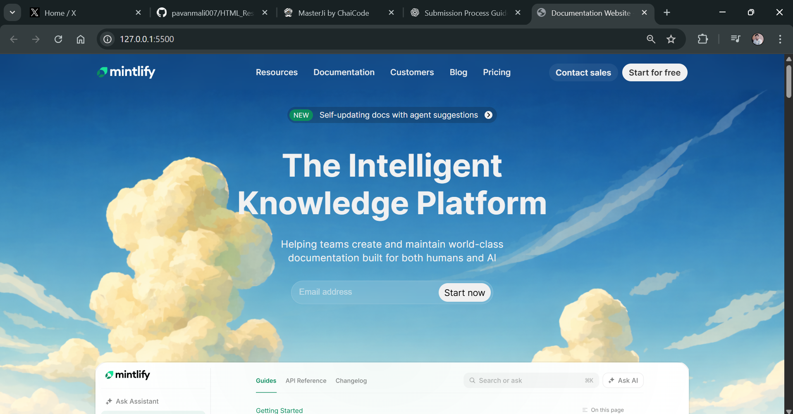

# Mintlify Documentation Website Clone

This project is a desktop-first documentation-style website inspired by the Mintlify documentation site.

The goal of this assignment was to recreate the **structure, layout, and visual hierarchy** of the original website using only HTML and CSS.

---

## Sections Recreated

- Top Navigation Bar
- Hero Section (headline, description, email input, CTA)
- Documentation Preview Section (sidebar + content cards)
- Trusted By / Logos Section
- Feature Highlights
- Intelligent Assistant / UI Preview
- Enterprise Features Section
- Case Studies / Customer Stories
- Final Call-To-Action
- Footer with multi-column links

---

## Tech Stack

- HTML5
- CSS3 (No frameworks)
- Desktop-first layout

---

## Constraints Followed

- No JavaScript
- No TailwindCSS
- No animations or fancy effects
- Desktop-only (no responsiveness)
- No AI-generated code

---

## Fonts & Colors

- Font: Inter (or system sans-serif equivalent)
- Colors inspired by Mintlify branding:
  - Primary: #0F172A
  - Accent: #6366F1
  - Background: #FFFFFF / #F8FAFC

---

## 📸 Screenshots

---

## 🌐 Live Preview

---

## 📄 Notes

This project focuses on layout accuracy, readability, and content structure similar to the original Mintlify documentation website.
